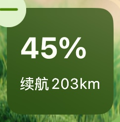
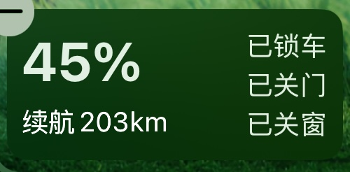
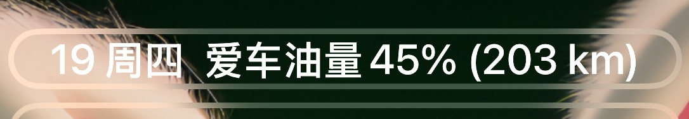
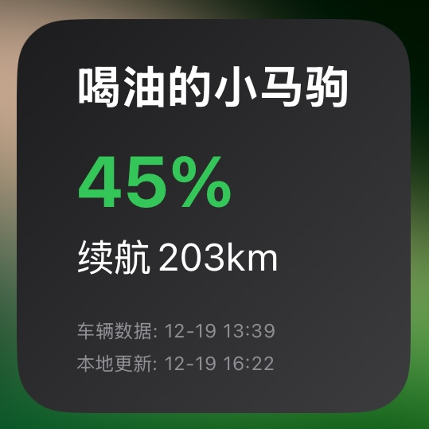
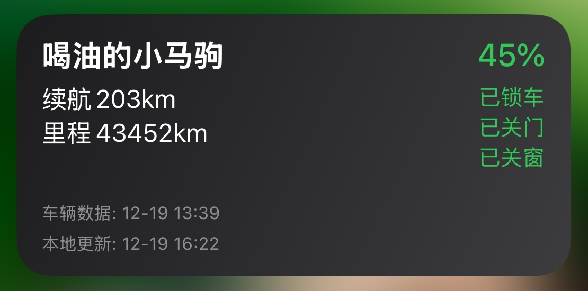
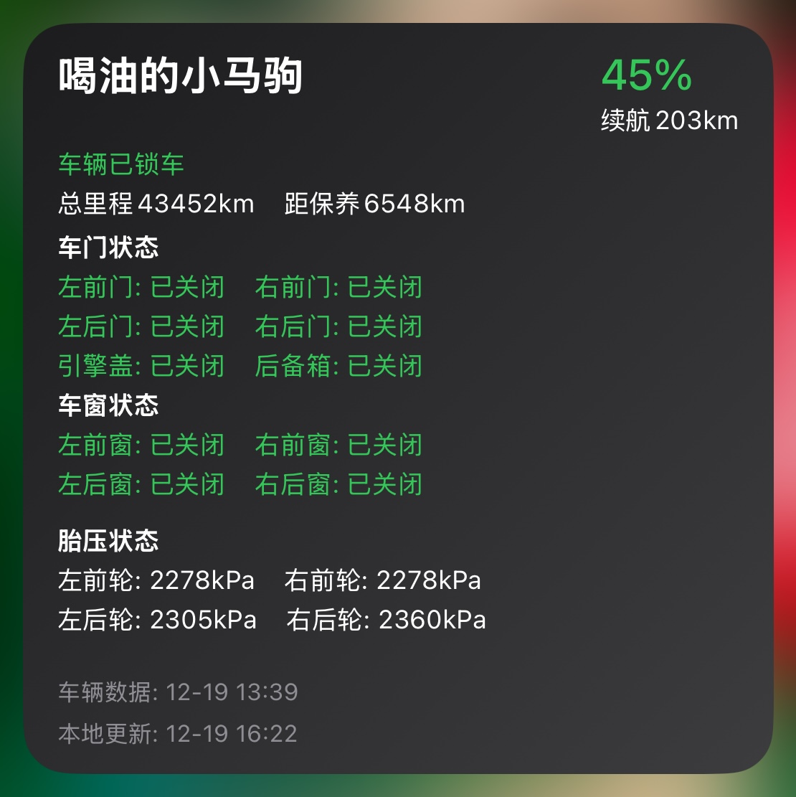

    
    <h1>Jaguar Land Rover Travel Widget</h1>
    
An elegant iOS widget for monitoring Jaguar Land Rover vehicle status

    

        
        
        
        
    

## ✨ Features

### 🚗 Comprehensive Vehicle Monitoring
- **Basic Information**
  - Real-time fuel level and range
  - Total mileage and maintenance reminders
  - Vehicle location information
  
- **Safety Status**
  - Door lock status
  - Window open/close status
  - Hood/trunk status
  - Tire pressure monitoring for all four wheels
  
### 🎨 Beautiful Visual Experience
- **Rich Widget Sizes**
  - Lock screen widgets (circular/inline/rectangular)
  - Home screen widgets (small/medium/large)
  
- **Personalized Interface**
  - Custom background images supported
  - Adjustable background darkness
  - Intelligent status coloring
  - Elegant information layout

### ⚡️ Intelligent Experience
- **Flexible Data Updates**
  - Customizable update intervals
  - Intelligent caching mechanism
  - Manual refresh supported
  - Dual timestamp display
  
- **Multi-Vehicle Support**
  - Manage multiple vehicles
  - Quickly switch monitored vehicle
  - Independent configuration saving

## 📱 Interface Preview

### Lock Screen Widgets

    <table>
        <tr>
            <td align="center" width="20%">
                
                 
                <em>accessoryCircular</em>
            </td>
            <td align="center" width="40%">
                
                 
                <em>accessoryRectangular</em>
            </td>
            <td align="center" width="40%">
                
                 
                <em>accessoryInline</em>
            </td>
        </tr>
    </table>

### Home Screen Widgets

    <table>
        <tr>
            <td align="center" width="20%">
                
                 
                <em>Small widget</em>
            </td>
            <td align="center" width="40%">
                
                 
                <em>Medium widget</em>
            </td>
            <td align="center" width="40%">
                
                 
                <em>Large widget</em>
            </td>
        </tr>
    </table>
    
<em>Supports multiple sizes and displays different levels of detail</em>

## 🚀 Getting Started

### System Requirements
- iOS 16.0 or later
- Scriptable App
- Jaguar Land Rover InControl account

### Installation Steps
1. Download and install [Scriptable](https://apps.apple.com/app/scriptable/id1405459188) from the App Store
2. Download the latest script from this project
3. Import the script into Scriptable
4. Run the script and follow the prompts to configure
5. Add the widget to your home or lock screen

### Usage Instructions
1. **Initial Setup**
   - Log in to your Jaguar Land Rover account
   - Select the vehicle to monitor
   - Set the update interval
   
2. **Add Widget**
   - Long press on the home or lock screen
   - Tap to add a widget
   - Choose Scriptable
   - Select this script
   
3. **Personalized Settings**
   - Customize background image
   - Adjust background darkness
   - Set update frequency

## 🛠 Advanced Configuration

### Update Interval Setting
- Minimum supported: 30 seconds
- Recommended: 10 minutes or more
- Adjustable as needed

### Background Image Setting
- Supports local images
- Supports iCloud images
- Adjustable darkness 0-100%

### Data Cache Management
- Automatic caching
- Manual clearing supported
- Intelligent expiration handling

## 📝 Changelog

See the full [changelog](CHANGELOG.md) for detailed version history.

## 🤝 Contribution Guide

All forms of contributions are welcome, whether new features, bug fixes, or documentation improvements.

1. Fork this repository
2. Create a new feature branch
3. Commit your changes
4. Create a Pull Request

## 📄 License

This project is open-sourced under the [GPL-3.0](LICENSE) license.

## ⚠️ Disclaimer

- This project is an unofficial tool and is not affiliated with Jaguar Land Rover Ltd.
- Land Rover, the Land Rover logo, etc. are registered trademarks of Jaguar Land Rover Ltd.
- Please comply with relevant laws, regulations, and user agreements when using this tool.

## 🙏 Acknowledgments

Thanks to all developers who contributed to this project!

## 📮 Contact

For questions or suggestions, feel free to contact:

- Submit an [Issue](https://github.com/otofoto/JLRWidgetKitForCar/issues)
- Email [xuyuanfang's email](mailto:xuyuanfang@whu.edu.cn)

---

    
If this project helps you, feel free to give it a Star ⭐️

    
Made with ❤️ by xuyuanfang

